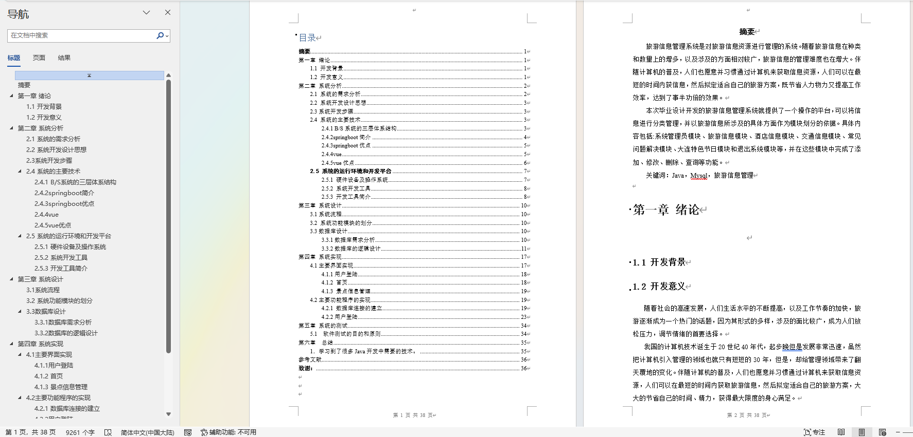

# 旅游信息推荐系统

### 9.9￥ 获取完整源码+sql，附赠9000字论文参考，需要加Q：3808981644 备用Q：3577148218
### 有问题，或者需要协助调试运行项目的也可联系
### 更多项目： https://github.com/34426?tab=repositories

## 一、介绍

### springboot+mybatis+vue前后端分离的旅游信息推荐系统

开发语言：java

运行环境:idea或eclipse vscode 数据库:mysql

功能简介：系统分为前台跟后台两个项目

用户：  浏览旅游新闻、景区信息、美食信息、旅游线路、在线留言、旅游线路、订单信息

管理员： 账号管理、地区管理、景点信息管理、地方美食管理、旅游线路管理、订单信息管理、新闻管理、系统管理

## 二、游客和用户界面部分功能页面展示

## 三、管理员界面部分功能页面展示

## 四、9000字文档参考

### 9.9￥ 获取完整源码+sql，附赠9000字论文参考，需要加Q：3808981644 备用Q：3577148218
### 有问题，或者需要协助调试运行项目的也可联系

