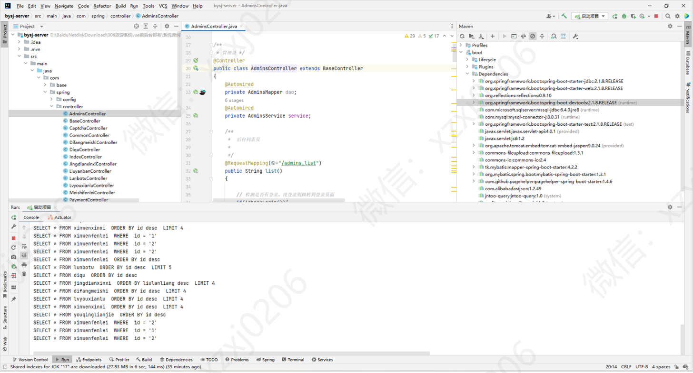
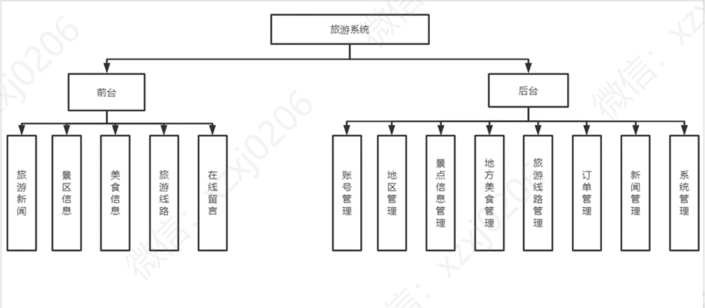
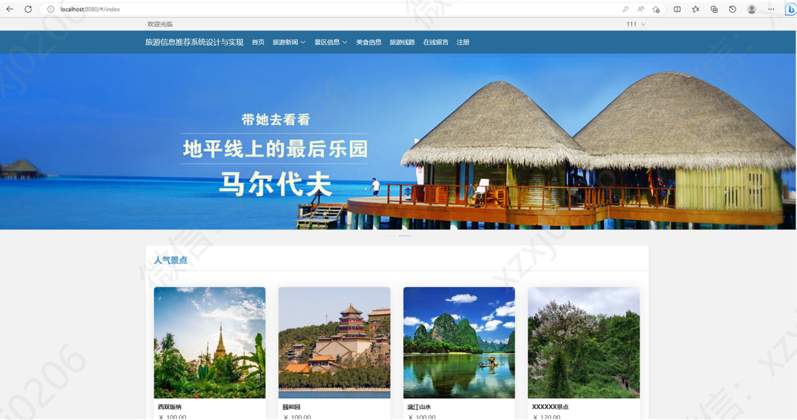
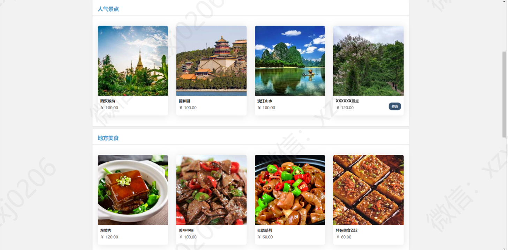
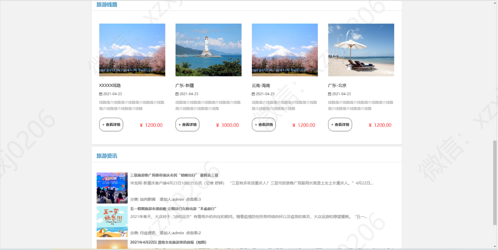
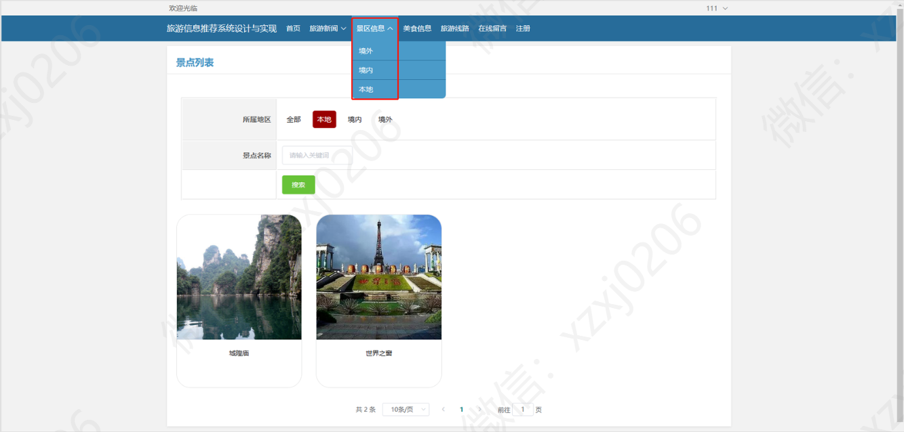
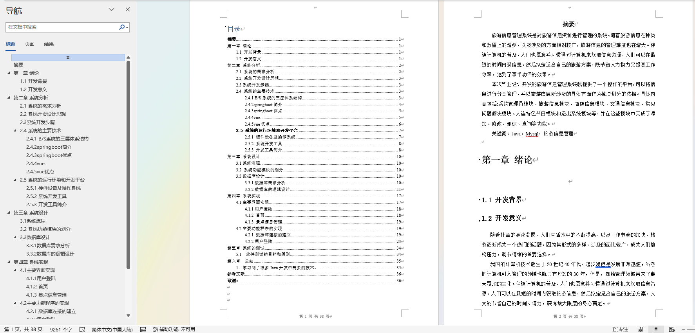

# 旅游信息推荐系统

## 一、介绍

### springboot+mybatis+vue前后端分离的旅游信息推荐系统

开发语言：java

运行环境:idea或eclipse vscode 数据库:mysql

功能简介：系统分为前台跟后台两个项目

用户：  浏览旅游新闻、景区信息、美食信息、旅游线路、在线留言、旅游线路、订单信息

管理员： 账号管理、地区管理、景点信息管理、地方美食管理、旅游线路管理、订单信息管理、新闻管理、系统管理

### 完整项目获取

通过网盘分享的文件：旅游信息推荐系统

链接: https://pan.baidu.com/s/1BtWz3y6xd6CRrMpl0gLQCA?pwd=iqn6 提取码: iqn6 --来自百度网盘超级会员v3的分享

通过网盘分享的文件：工具包

链接: https://pan.baidu.com/s/1YmdoJvkjoUjA75wvHLDZ6A?pwd=xm96 提取码: xm96
--来自百度网盘超级会员v3的分享

需要远程项目部署或项目修改和毕业设计也可联系（添加申请时请备注好来意）

通过网盘分享的文件：远程调试部署联系方式

链接: https://pan.baidu.com/s/1W0dDcoZmayG0c7USJDYBYg?pwd=nqd7 提取码: nqd7
--来自百度网盘超级会员v3的分享

### 项目合集(项目不断更新中)
链接: https://pan.baidu.com/s/1nY-zhvAK0CXYcn3g7LzQnQ?pwd=id3c 提取码: id3c
--来自百度网盘超级会员v3的分享

#### 这些项目一起发你了 可以分享给你需要的同学 调试可找我 也接二次修改和项目定制、毕业设计等

## 接毕业设计和论文

微信联系方式：xzxj0206  QQ：3808981644   (支持修改、 部署调试、 支持代做毕设)

接网站建设、小程序、H5、APP、各种系统等，单片机、嵌入式也可以做

选题+开题报告+任务书+程序定制+安装调试+论文+答辩ppt  都可以做

## 二、游客和用户界面部分功能页面展示

## 三、管理员界面部分功能页面展示

## 四、9000字文档参考

